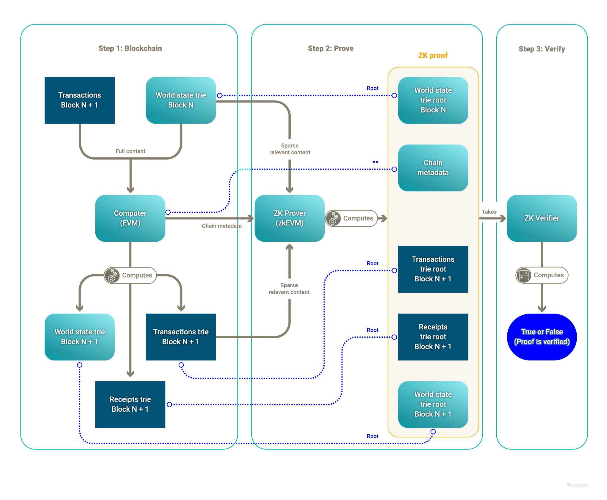

# Why Topos?

In a nutshell, Topos brings ease of deployment, uniform security, scalability and provable computation to cross-chain transactions.

In the rapidly evolving world of blockchain technology, the importance of scalability, security and efficiency cannot be overstated. As developers and businesses explore the potential of decentralized applications (dApps), they seek a platform that can deliver on these fronts. This is where Topos stands out. With its advanced approach to blockchain architecture, the Topos ecosystem addresses the critical challenges faced by other blockchain platforms. It offers:

* **High blockspace supply**
* **Robust security measures**

## High blockspace supply

Topos provides an impressive degree of **scalability**. It can handle substantial computational loads without compromising performance, which provides an efficient mechanism to create and broadcast certificates.

## Robust security measures

The safety of the Topos ecosystem is independent of the security of the participating blockchains (called subnets). It is computationally infeasible for malicious subnets to create invalid state transitions or to create conflicting states in order to double spend across the ecosystem.

<HighlightBox type="info" title="Info">

In the sections that follow, you will delve into these aspects in more detail to gain a comprehensive understanding of what makes Topos a unique and powerful choice on which to develop and host dApps.

</HighlightBox>

## Computing power

Topos is designed with a unique architecture that alleviates computational bottlenecks in two major ways. Firstly, it allows for boundless **horizontal scalability**, through the use of a passive and lightweight settlement layer that supports multiple connected subnets. Secondly, it enables **computation compression** through the use of validity proofs, which replaces costly re-execution with succinct verification.

<Accordion>
<AccordionItem title="Horizontal scalability">

Each subnet in Topos operates independently with its own consensus protocol, effectively acting as an individual blockchain with sovereign execution. This architecture allows the overall system to process more transactions in parallel. New subnets can be added systematically as demand for blockspace increases, thereby increasing global throughput without causing slowdowns. The result is an ecosystem that can handle a larger volume of transactions as demand increases.

In this regard, the design of Topos stands out from traditional blockchain networks that rely on a single chain for all transactions. Traditional blockchains often face bottlenecks and slower transaction speeds as the number of users increases. By allowing multiple subnets to function independently, Topos sidesteps these limitations and provides a more scalable solution.

You do not need to develop or adapt your own bridge, as Topos offers a messaging protocol (or standard) that leverages the security guarantees of the Topos protocol when transmitting transactions from source subnets to target subnets.

</AccordionItem>
<AccordionItem title="Computation compression">

Interoperability is good, but interoperability with cryptographic security is better.

Topos allows any interested party to cheaply verify the validity of state transitions of each and every subnet. This is achieved through the use of validity proofs. For each block, each subnet emits a validity proof computed with a zero-knowledge Ethereum Virtual Machine (zkEVM). With validity proofs, the verification of the computation is much cheaper than the original computation. Therefore, besides its other valuable properties, an advantage of validity proofs is to provide very efficient verification.

Interested parties can verify validity proofs. In the Topos ecosystem, the nodes that form the Transmission Control Engine (TCE) verify these proofs as part of the settlement of subnet certificates.

Overall, Topos can be seen as an unbounded global network of parallel and interoperable blockchains.

</AccordionItem>
</Accordion>

## Advanced security

Topos was designed to serve as the base layer of the internet by reducing trust assumptions in involved parties as much as possible and replacing them with cryptographic constructions and decentralization. Alongside this, Topos is engineered to exhibit massive scalability, envisioning a future where these attributes become the norm for online infrastructures.

### Certificates for secure communication

In Topos, **certificates** play a crucial role in ensuring secure and reliable communication between different subnets. A **certificate** is a data package that proves the validity of a sequence of transactions.

A certificate is _created_ by a **source** subnet, _sent_ to the TCE, and then onwards to a list of **target** subnets. Certificates allow target subnets to safely execute cross-subnet messages.

<HighlightBox type="info" title="Note">

Certificates **do not** contain any of the transactions that are proven by the validity proof. Certificates only contain the validity proof as well as the metadata necessary to verify the proof.

</HighlightBox>

<HighlightBox type="info" title="Note">

The Topos protocol effectively addresses the security risks inherent in cross-chain technology, providing a high level of privacy and security for applications. For developers, this means they can build secure and natively interoperable dApps.

</HighlightBox>

## Privacy through zero-knowledge proofs (ZKPs)

### ZKPs in general

ZKPs are a form of cryptographic method that allow one party to prove to another party that they know specific information, _without revealing any private information_. Certain variants of ZKPs are used to prove that a potentially complex computation was performed, with the verification of the ZKPs taking significantly less time than the initial computation. These methods enable privacy without adding any significant computation burden.

### ZKPs with Topos

In the context of Topos, ZKPs are used to prove that transactions have been validated and their outcomes computed according to the protocol while keeping sensitive transaction details hidden. This technology represents a significant advancement in maintaining user privacy while retaining the ability to transparently verify the transaction history.

# Up next

In the next section, you will explore an overview of some use cases for Topos technology.
