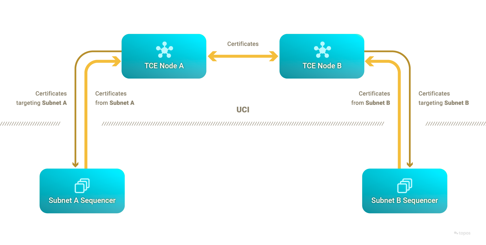
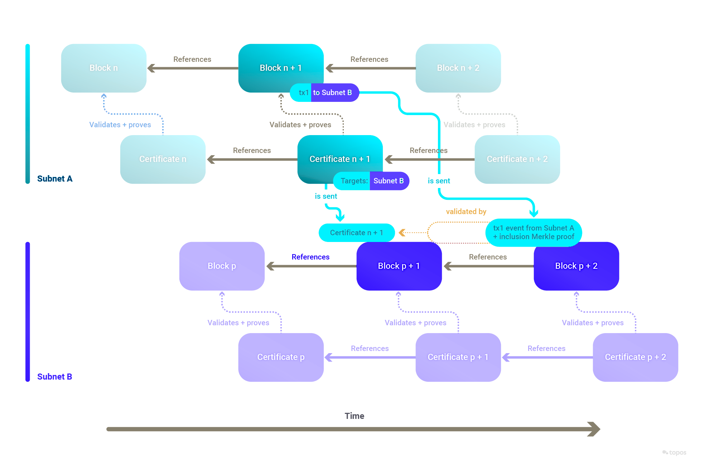

# The Topos protocol

The Topos protocol comprises several elements:

* **Subnets**
* **Universal Certification Interface (UCI)**
* **Sequencers**
* **Transmission Control Engine (TCE)**
* **Topos contracts**

This section will review these elements in turn.

Do not be intimidated by the above diagram, as you will review its details in the following sections.

## Subnets

Topos allows communication across so-called **subnets**. A subnet is composed of components including a state machine. This state machine can be a blockchain, and it will commonly be a blockchain, which will be the focus here. It is important to note, however, that there is no requirement for the state machine to be a blockchain. Thus, a subnet could be built around a legacy applications, databases, key-value stores, and anything else that can be represented as a state machine.

There is also a special subnet, called the **Topos Subnet**. This uses a blockchain as its state machine and serves to register other subnets in the ecosystem, using TOPOS as its native asset. This is a resistance mechanism against [Sybil attacks](https://en.wikipedia.org/wiki/Sybil_attack). It also acts as an on-chain governance platform for future improvements to the Topos protocol.

<HighlightBox type="info" title="Note">

The deployment of a subnet and its registration in the Topos Subnet is permissionless and can be done by anyone at any time.

</HighlightBox>

In order to benefit from Topos guarantees, a subnet submits and receives certificates to and from the **Transmission Control Engine (TCE)** network. To this end, the subnet needs to conform to the **Universal Certification Interface (UCI)**.

<HighlightBox type="info" title="Early stage">

The initial subnets will contain blockchains based on [Polygon Edge](https://github.com/0xPolygon/polygon-edge).

</HighlightBox>

## Universal Certification Interface (UCI)

The [UCI](https://github.com/topos-protocol/topos/blob/main/crates/topos-uci/src/lib.rs) is an interface that needs to be implemented by subnets through the subnet's **sequencer** to send and receive **certificates** to and from the TCE – which can only reason about certificates complying with the UCI.

### Certificates

A certificate contains (on a high level):

* A proof of computational integrity of a state transition created by the zero-knowledge Ethereum Virtual Machine (zkEVM) or a specialized prover.
* A Schnorr signature to identify the source subnet
* Metadata to verify the proof
* A list of the target subnets

Once the sequencer has a validity proof, it inserts it in an unsigned certificate and sends the latter to the subnet's validators for signature. The signature must be Schnorr-based and subnets are provided with the default **ICE-FROST** signature scheme.

The certificates of a specific subnet form a linked list, in which each certificate refers to its immediately preceding certificate.

### Threshold Signatures (ICE-FROST)

Each subnet wishing to participate in the Topos ecosystem needs to register on the Topos Subnet. What gets registered is the new subnet's public key, commonly referred to as the **subnet's ID**. A subnet's ID must remain static throughout its lifetime and through cycles of private key regeneration.

Topos is agnostic as to how a subnet generates its public key as long as it remains static. Schnorr signatures on certificates are supported, and the [ICE-FROST](https://github.com/topos-protocol/ice-frost) Distributed Key Generation (DKG) scheme accounts for malicious validators, or validators that may be offline. Subnets can use ICE-FROST to generate Schnorr signatures in a distributed manner, and hence create a certificate after the chosen threshold is met. It is up to a subnet's governance, or administrators, to choose to use ICE-FROST or another scheme.

ICE-FROST has several advantages:

* It generates **static keys**, so that if the set of participants changes the public key does not need to be changed. In a process called "resharing", each future participant receives a new private chunk of the private key.
* It is **robust** in the sense that, if in the key generation or the resharing phase some participants are malicious, a public key will still be generated and those participants will be identified.
* It will identify malicious participants during each signature phase, so if desired they can be excluded and the signature phase can be redone.

### Zero-knowledge Ethereum Virtual Machine (zkEVM)

The zkEVM is a tool that generates **zero-knowledge proofs (ZKPs)** of the correct execution of subnet transactions.

It uses the [plonky2](https://github.com/topos-protocol/plonky2) library to create proofs for the subnet. These proofs are used by the sequencer to create certificates asserting the validity of subnet state transitions.

Each transaction of a subnet is first executed by the EVM blockchain, which keeps a record of the computed state. The transaction is then passed to the Topos zkEVM or a specialized prover to create the proof.

## Sequencers

A subnet's [sequencer](https://github.com/topos-protocol/topos/blob/main/crates/topos-sequencer-subnet-client/src/lib.rs) is a program that interacts with the blockchain and the TCE network. One of the subnet's validators will run the sequencer in order to receive and submit certificates.

The sequencer can create outgoing certificates by leveraging the **zero-knowledge Ethereum Virtual Machine (zkEVM)** or by delegating this task to a specialized prover.

## Transmission Control Engine (TCE)

The TCE is a permissionless network which implements a primitive of reliable broadcast that is leveraged to order and settle certificates in a more optimal way than under consensus (that is, the TCE does not enforce total order of commands and is highly parallelizable). It only verifies the validity proofs in certificates coming from subnets, which removes the need for a Turing-complete virtual machine on the TCE.

A subnet sequencer can send certificates to any TCE node and can subscribe with a TCE node for certificates that mention a certain subnet ID (typically their own) in the certificate's target list. When a certificate matches the subscription's parameters, the TCE node forwards it to the subscribed sequencer.

### `ToposCore` smart contract

`ToposCore` is a smart contract that handles the basic functionalities. It has **two primary roles**:

* On source subnets, it emits the cross-subnet events that are to be picked up by the sequencer.
* On target subnets, it handles the reception and recording of certificates from source subnets. It keeps track of published certificates, storing them and making them accessible to other elements of the Topos system.

It is optional, although any replacement should emit the event that the sequencer expects.

<HighlightBox type="info" title="Info">

It is worth mentioning that a subnet only needs to record certificates where it is mentioned as a target.

</HighlightBox>

### Messaging protocol smart contracts

The messaging protocol smart contracts **implement** the **semantics** of cross-subnet messages and leverage the security guarantees of the Topos protocol. It is up to every cross-subnet messaging protocol developer to decide what the semantics are, and how best to make use of the Topos protocol.

To demonstrate best practices and accelerate development, `ToposMessaging` was built as an inheritable smart contract that relies on the functionality of `ToposCore`. It handles the verification of inclusion proofs against the recorded certificates from source subnets. Beyond verification, it ensures that a cross-subnet message is not replayed. A [replay attack](https://en.wikipedia.org/wiki/Replay_attack) is a situation where a valid data transmission is maliciously repeated or delayed. Typically, a developer would inherit from `ToposMessaging` to benefit from these.

An example of such a messaging protocol is **ERC20Messaging**, which implements cross-subnet transfers of _internal_ ERC-20 tokens. It uses the infrastructure provided by `ToposMessaging` for secure and verified transactions, enabling seamless interactions between chains and promoting interoperability. As an illustration of the semantics selected for ERC20Messaging, it burns tokens on the source subnet and mints them on the target subnet.

Further, as an example of user-friendly architecture, an executor service was built which waits for certificates to be recorded in a target subnet's `ToposCore` before submitting and therefore executing relevant cross-subnet messages.

## Properties of Topos

One of the main reasons why developers opt for a particular blockchain protocol over others is the guarantees it provides. With its state-of-the-art architecture and its innovative technologies, Topos offers multiple future-proof benefits from the perspectives of scalability, security, privacy and interoperability.

### Uniform security

In the Topos ecosystem, subnets provide highly secure, interoperable, and scalable blockspace. Moreover, each subnet is inherently as secure as the entire system. This means that the level of security is homogeneous (uniform) across all subnets, a characteristic termed as uniform security.

This uniformity significantly enhances the robustness of interoperable dApps. No matter which blockspace a dApp is deployed on, it will retain the same level of security. Hence, concerns regarding blockspace security no longer plague dApp developers, freeing them to focus on other aspects of their work.

This approach offers substantial advantages for application-specific blockchains. By integrating with the Topos ecosystem as a subnet, developers leverage the collective security of the network. They forgo the struggle of starting from a blockchain that is susceptible to attacks or even merely perceived as insecure, mitigating the initial costs and concerns and creating a more conducive environment for development.

By eliminating these barriers, we foster a more robust and secure ecosystem for dApps that span multiple blockchain networks. This ultimately leads to the development of a more **integrated, interoperable** blockchain infrastructure that is more conducive to widespread adoption and innovative dApps.

### No blockspace fragmentation

All subnets are created equal in terms of the dApps they can host. This is different from an ecosystem where the base layer (think layer 1) implements smart contracts, while layer 2's compete for access to the base layer's highly secure blockspace, which creates a system that is highly fragmented.

In Topos, the base layer (TCE) does not compare to traditional layer 1 blockchain. It does not implement a Turing-complete virtual machine, nor does it involve consensus. This absence of consensus removes the need for state machine replication.

### Scalability

While uniform security is crucial in building an effective and secure blockspace-producing ecosystem, it's not sufficient on its own. Although it guarantees the homogeneous quality of the blockspace, it should be paired with a scaling mechanism to ensure a steady and reliable blockspace supply.

Thanks to the fact that validity proofs compress transaction execution and allow very cheap verification, the Topos ecosystem provides an overall blockspace supply which scales very well and can support arbitrarily many subnets. Therefore, Topos provides a **secure** and **reliable** blockspace supply.

<Accordion>
<AccordionItem title="In fact it scales exponentially in the number of subnets">

This is because, if `n` is the number of transactions:

* The computation to be executed by the subnets is `O(n)`.
* The computation to be executed by the prover is something like `O(nlog^2(n))`.
* The verification of the proof is something like `O(log^2(n)`.

So the verifier scales exponentially compared to the prover.

</AccordionItem>
</Accordion>

### Non-equivocation

With its uniform security, Topos addresses the critical issue of equivocation, which is one of the main challenges to enabling secure cross-chain messages.

<HighlightBox type="info" title="Equivocation in distributed systems">

In the context of distributed systems, equivocation refers to a scenario where a node or actor exhibits **contradictory behavior**. In blockchain, this can lead to [double spending attacks](https://en.wikipedia.org/wiki/Double-spending).

</HighlightBox>

The Topos protocol prevents equivocation across subnets by ensuring that, once a transaction is certified by a certificate and that certificate is settled by the TCE, a **conflicting certificate** (for instance one that attempts to double spend a transaction) will not be settled by the TCE.

Upon the settlement of a certificate by the TCE, it is guaranteed that no subnet will subsequently receive certificates that encompass states exhibiting equivocation.

### Privacy

Topos also provides guarantees of privacy. In its certificates, Topos leverages proofs of computational integrity on which zero-knowledge can be applied to preserve the privacy of subnet states when they interoperate. A source subnet can prove the validity of its state transitions **without revealing** any details with respect to **its state**.

<HighlightBox type="tip" title="Example">

Alice holds 100 FUN tokens on Subnet A and sends 1 token to Bob on Subnet B using the ERC20Messaging protocol. This transaction results in two events:

1. `CrossSubnetMessageSent` is emitted from `ToposCore` with Subnet B's ID.
2. An event is sent from the `ERC20Messaging` smart contract with `event = { to: Bob, amount: 1, token: "FUN" }`.

The transaction's state transition (which includes these events) is then certified by a certificate that is settled by the TCE.

Implied with this event is the knowledge that Alice started with at least a balance of 1 FUN token. In fact, after the transaction, Alice has a remaining balance of 99 FUN tokens on Subnet A. How does factual information about the transaction remain private?

* The certificate mentions Subnets A and B, but makes no direct mention of "Alice", "Bob", "FUN", "1" or "99". However, given the right values, it could be used to prove that Alice's transaction took place and resulted in the `event`. This means that none of the TCE nodes (and none of the subnets that receive _only_ this certificate) know details of this transaction, or even of its existence.
* The proof of inclusion sent to Subnet B only includes the transaction's receipt (which includes `event`) and its Merkle proof, implying that whoever the sender was they started with a balance of at least 1. Therefore, information about Alice's starting and remaining balances is known on Subnet A but is in effect private, as it was never transferred across subnets. Moreover, depending on the type of events emitted, even Alice's sending address could be kept private.

</HighlightBox>

In addition, subnet administrators are free to decide whether they want to **take a subnet private**, in which case even the nodes and their APIs are not publicly available.

### Low barrier of entry

Like an ever increasing number of projects, Topos subnets are **EVM-based**. Given that Ethereum and EVM have become established as the main initial entry point for developers entering the web3 space, the **largest pool of web3 developers** can develop on Topos.

<HighlightBox type="tip">

In conclusion, Topos provides optimal guarantees that uphold the integrity of cross-chain transactions, secure message delivery across chains and preserve the privacy of users. These guarantees make it an appealing choice for developers looking for a secure, scalable and efficient protocol for their decentralized applications.

</HighlightBox>

# Up next

The following section will clarify the concept of cross-chain and cross-subnet messages.
