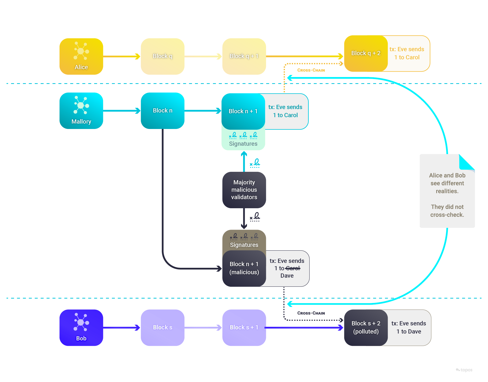
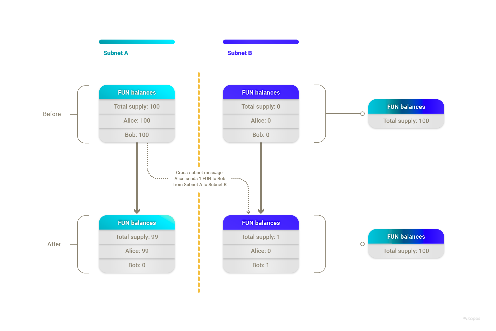

# Cross-chain and cross-subnet messages

This section refers to **cross-subnet** messages and protocols in the context of Topos, and **cross-chain** transactions and protocols when describing methods of transferring arbitrary data (such as tokens) between disconnected, independent blockchains. Cross-chain protocols are commonly referred to as "bridges".

## Cross-chain transactions and protocols

**Cross-chain transactions**, as the name suggests, are transactions that occur between two different blockchains. These transactions enable the exchange of information, value or state from one blockchain to another, facilitating a level of interoperability previously not feasible. This interoperability opens up myriad possibilities, including the exchange of tokens across different blockchains, interaction between smart contracts on different chains and seamless access to a wide range of DeFi services, among others.

**Cross-chain protocols** serve as the conduit for these cross-chain transactions. A cross-chain protocol is a connection that allows the transfer of tokens or arbitrary data from one chain to another. Both chains can have different protocols, rules and governance models, but the cross-chain protocol provides a compatible way to securely interlink these two separate systems.

Cross-chain protocols play a crucial role in extending the utility of blockchains. For instance, with cross-chain protocols a DeFi product built on one blockchain can seamlessly integrate and offer services with another blockchain. This widens the spectrum of services and increases the overall value proposition of the application.

While the concept of cross-chain transactions and protocols are simple in theory, they are quite complex in practice. This is due to the inherent challenges of ensuring secure and reliable transactions between two entirely independent blockchains, which may have different consensus mechanisms and security models. The following sections will explore these challenges and Topos's innovative solutions to them.

### Cross-chain protocols

When a transaction _crosses_ from one blockchain to another, a typical cross-chain protocol oversees secure communication between the two. It can be thought of as a type of translator that understands and interprets the languages (protocols) of both blockchains involved in the transaction. The protocol is enforced by one or more servers, usually named **relayers**.

At a high level, a relayer's role involves several crucial steps:

1. **Listening:** The protocol defines events or transactions to constantly listen for on both chains. The relayer has nodes running on both chains that are designed to detect when a user initiates a cross-chain transaction.
2. **Locking or burning assets:** When a user initiates a cross-chain transaction, the relayer locks or burns the assets on the originating blockchain. This step is essential to ensure that the same assets are not spent twice – once on the originating chain and once on the receiving chain.
3. **Issuing or minting assets:** After verifying the transaction and locking or burning the original assets, the relayer issues/mints the corresponding amount of assets on the receiving chain. This essentially creates a representation of the locked or burned assets on the other blockchain.
4. **Relaying:** The relayer relays the information between the two blockchains, effectively carrying out the transaction.
5. **Unlocking or re-minting assets:** If the assets were locked and a reverse transaction occurs, the relayer will unlock the assets on the original blockchain. If the assets were burned instead, equivalents are re-minted. This effectively moves the assets back to the original blockchain.

The cross-chain protocol must be designed to ensure the integrity, security and consistency of transactions across different blockchains. It follows the rules of both blockchains, and it assumes the rules are respected and that transactions are correctly executed. However, there are a few challenges associated with carrying transactions across two different ecosystems.

### Common challenges with cross-chain transactions

<HighlightBox type="tip" title="The need to understand common challenges">

While holding immense potential, cross-chain transactions pose significant challenges in terms of security and reliability. Understanding these challenges is pivotal to appreciating the innovative solutions that Topos offers.

</HighlightBox>

Blockchains are designed to be **self-sufficient decentralized ledgers**, with the state of a given instance of a blockchain being the only correct interpretation of the history of that instance.  The internal state is the result of deterministic computation. In summary:

* An initial state was created, according to a prescribed protocol.
* Cryptographically signed transactions occurred, according to a prescribed protocol.
* Each node was independently able to compute all transactions deterministically and output the same state.
* The resulting state transitions are found to be the only way that the state changes could have occurred, according to the prescribed protocol.

Consequently, the state is the only correct interpretation of the history of the blockchain, and it can be proven correct. This is what we mean by "consistency" in this context.

Blockchains have no knowledge of the _outside_ world, apart from the external accounts that sign transactions that cause state transitions. Therefore this property of consistency does not on its own apply between blockchains. Each blockchain operates absent the ability to confirm the correctness of external data sources, including the state of APIs or, importantly, the state of other blockchains.

A common solution to this problem is to rely on an external actor, known as an "oracle" or "bridge", which is tasked with monitoring the state of one chain and signing an input to the receiving chain. This is not as easy as it might first appear.

For any cross-chain transaction to be secure and of value, three important proofs are required:

* **Inclusion proof:** This is a cryptographic proof that the cross-chain transaction was included as part of the source chain's canonical state. It is the most straightforward proof to accomplish since it merely involves providing the source chain's block header and a Merkle proof, which is essentially a path in the Merkle tree from the transaction up to the Merkle root. Its usefulness rests on the honest majority assumption on the source chain.
* **Validity proof:** This is a cryptographic proof that verifies the correctness of the state transitions of the sending chain (that is, that they follow the rules of the network and do not, for example, create money out of thin air or spend someone else's money). This is more complex, as it requires proving the actual execution of the consensus rules of the sending chain.
* **Non-equivocation proof:** This is a cryptographic proof attesting that the validators of the sending chain have not equivocated (that is, they did not finalize two conflicting states within a fork). This is to guarantee the unicity of the state of the sending chain and in particular to prevent double spending across multiple blockchains, a form of fraud where the same coins are spent more than once by creating different state transitions for different observers.

The foregoing proofs focus on reliably representing the state of one chain to another, but there are additional implementation challenges to consider as well. Various incidents in the past have underscored the difficulty and seriousness of these challenges. Many of the biggest heists in the blockchain arena (where technology was a factor) involved exploiting cross-chain vulnerabilities. For some examples, read [What Went Wrong: Biggest Blockchain Bridge Hacks](https://limechain.tech/blog/biggest-blockchain-bridge-hacks-2022/).

### Cross-chain state validity

It is virtually impossible for a receiving blockchain to re-compute all the actions performed on the sending blockchain due to the prohibitive computational overhead. This becomes a significant challenge when ensuring the security and correctness of cross-chain transactions.

### Cross-chain double spend risk

This is a subset of the non-equivocation problem, where an entire blockchain is malicious and presents different realities to different observers.

The following sections will explore how the Topos protocol addresses these cross-chain challenges to enable cross-subnet messages. It offers a secure and efficient solution for interoperability within the blockchain universe.

## The Topos protocol as a solution

The Topos protocol and ecosystem solve the challenges of performing secure and native cross-chain transactions. The protocol defines a set of objects and actions, called **cross-subnet messages**, to perform cross-chain transactions.

By way of example, imagine the following cross-subnet token transfer:

* FUN is a fungible token that exists on both Subnet A and Subnet B.
* As a starting state, Alice holds 100 FUN tokens on Subnet A.
* Alice sends a transaction on Subnet A containing a message that transfers 1 FUN token to Bob on Subnet B.

Importantly, as part of the transaction and its message, the following occurs on Subnet A:

* The transaction generates an event that mentions Subnet B's ID.
* The message leads to 1 FUN being burned from Alice's balance on Subnet A.

Thanks to Topos's guarantees, the following steps can now be taken confidently:

* Someone sends a transaction, this time on Subnet B, with the message mentioning "Bob", "1" and "FUN", alongside a proof.
* 1 FUN is minted on Subnet B with Bob as the holder.

### Inclusion proof

Inclusion proofs are a cryptographic mechanism that is used to prove that a specific transaction or piece of data is included within a block. These proofs rely on the concept of a Merkle tree, which is a binary tree of hashes used for efficient data verification. The beauty of inclusion proofs is that they allow for the verification of a specific piece of data without needing the entire dataset, providing an efficient method of proving data inclusion.

In the current example, inclusion is proven with:

* Subnet A's block header, signatures and stakes.
* A Merkle proof that `event1`'s receipt is included in the block's "receipts" Merkle tree.

### Validity proof

Instead of proving the validity of a subnet's state transitions by re-executing the transactions, Topos leverages **validity proofs** of execution. These proofs allow for the verification of subnet state transitions without requiring each verifying actor to perform the state transitions themselves, or even to have access to all of the underlying and potentially sensitive data (such as state or transaction details). The information necessary to verify the proof is included in a certificate and exchanged over the Transmission Control Engine (TCE).

In the current example, a validity proof is created based on the following elements:

* There is an input state, represented by a Merkle root of Subnet A’s starting state.
* There is an input list of transactions, represented by a Merkle root of the transactions that went into Subnet A’s block.
* There is an output state, represented by a Merkle root of Subnet A’s ending state.
* There is an output list of receipts, represented by a Merkle root of the receipts of the transactions that went into Subnet A's block.

Running the verification function with the above elements as inputs attests to the validity of the state transition claimed by a subnet (from a previous state that was committed to, to a new committed state). This algorithm can only output true if the prover submitted a valid state transition as part of its (private) input, corresponding to valid executions of the subnet's virtual machine.

### Non-equivocation proof

To verify that a subnet does not equivocate on its state, Topos relies on certificates exchanged over the TCE. It is the TCE network that provides the non-equivocation proof, in that TCE nodes will not deliver conflicting or repudiating certificates to subnets.

As a side note, each certificate is signed _by the subnet_ that emitted it. Each subnet can decide how to sign its certificates, and can use the default ICE-FROST threshold signature scheme provided as part of the SDK.

# Up next

Now that you know the basics of cross-subnet messages, it's time to take a deep dive into the details of the transaction flow.
