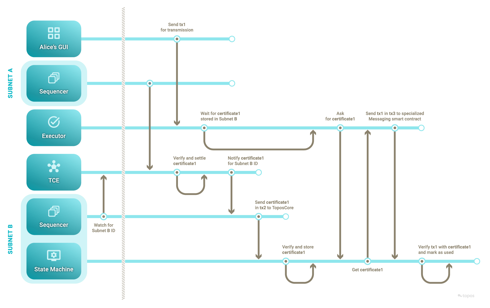
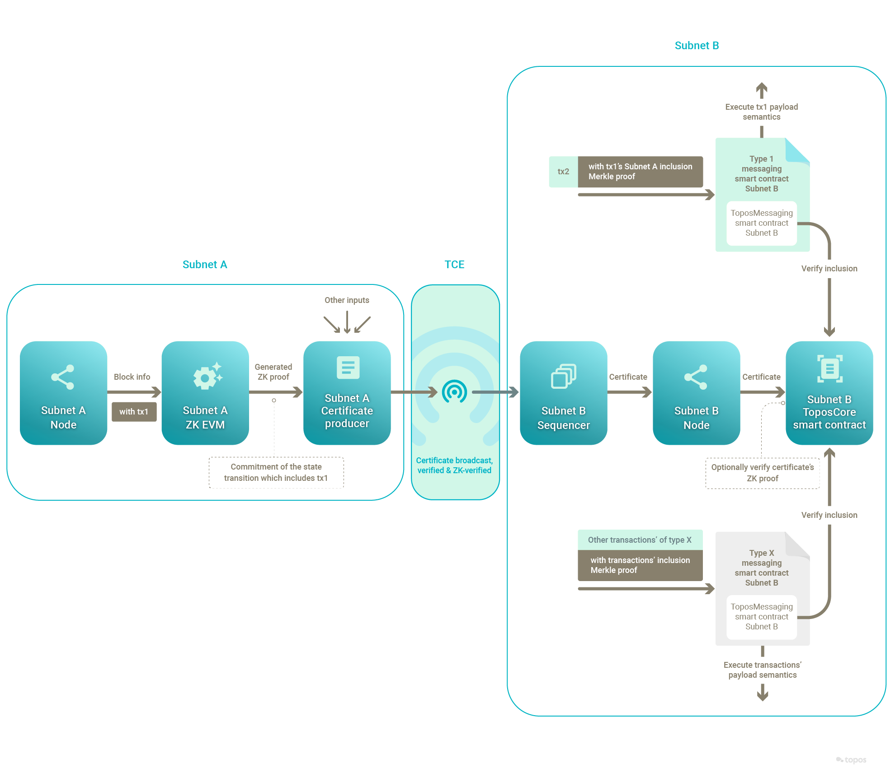

# Cross-subnet messaging protocol

The Topos protocol provides for the creation, verification and delivery of certificates of any subnets.

The developers of dApps and cross-subnet messaging flows can leverage these certificates to design **secure messaging protocols**. By storing relevant certificates on-chain, it is possible to benefit from their security guarantees when handling cross-subnet messages.

To demonstrate best practices and help bootstrap subnet administrators, Topos has created a series of smart contracts:

1. The **ToposCore** smart contract can be used to store certificates on-chain. Although not compulsory, it makes sense for a subnet to have a single instance of such a certificate-storing smart contract.
2. The **ToposMessaging** smart contract gathers functionalities that are core to messaging protocols. It has functions to verify proofs of inclusion and to mark completed messages as used, thereby preventing replay. To ease the development of new messaging protocols, these functionalities can be obtained for free by creating a messaging protocol smart contract that inherits ToposMessaging.
3. **ERC20Messaging** is an example of a messaging protocol smart contract that implements the semantics of a cross-subnet ERC-20 token transfer. It inherits from ToposMessaging. With ERC20Messaging, it is possible to deploy new ERC-20 token smart contracts, and to use those to send and receive cross-subnet token transfers. With this contract, a cross-subnet token transfer was chosen to consist of a _burn_ on the source subnet and a _mint_ on the target subnet.

The **delivery** of cross-subnet messages is not part of the Topos protocol, but instead is left to the administrators of subnets. Here again, Topos has created an example of a delivery mechanism, called the **executor service**, which is compatible with ToposCore and ERC20Messaging.

To develop intuition about how this works, consider this non-exhaustive description of the process and the concerns that are addressed by the protocol. It demonstrates a cross-subnet ERC-20 transfer implemented via ERC20Messaging and the executor service.

1. On the source subnet:
    * The user **allows** the ERC20Messaging contract instance to be a spender (and therefore burner) of a number of its tokens.
    * The user sends a transaction that is a call to the **`sendToken`** function of ERC20Messaging, **specifying** a target subnet ID where the same amount of tokens are to be minted, along with the amount and a recipient.
    * The ERC20Messaging contract **burns** the requested amount of tokens.
    * ERC20Messaging instructs ToposCore to **emit** a `CrossSubnetMessageSent` event with the target subnet ID.
    * The sequencer **initiates** the creation of a certificate.
    * The sequencer **detects** the `CrossSubnetMessageSent` event and adds the target subnet ID to the certificate's target list.
    * The sequencer **generates** a proof of the state transition that includes the transaction (or delegates the proof generation to a specialized prover) and includes it in the certificate.
    * The subnet **signs** the certificate. For instance, the subnet validators generate a threshold signature using ICE-FROST.
2. With the executor service:
    * The user's dApp frontend **sends** the target subnet ID plus the Merkle proof of the transaction's full receipt (which is included in the proof) to the executor service. The executor service happens to be at least configured for transfers between the source and target subnets.
    * The executor service keeps this information and **waits**.
    * This first part can be summarized thus:

    
3. On the Transmission Control Engine (TCE), between subnets:
    * The sequencer **sends** the certificate to the TCE.
    * The TCE participants **deliver** the certificate.
    * Subscribed sequencers **hear** about any certificate that mentions their subnet ID in its target list.
4. On the target subnet:
    * The sequencer **hears about** the relevant certificate.
    * The sequencer **confirms** that the certificate mentions its subnet ID as a target and **records** the certificate in ToposCore (if it is found acceptable).
    * The executor service queries ToposCore for the certificate (passing the receipts root matching that of the original transaction's state transition).
    * The executor service sends a transaction that is a call to the **`execute`** function of the ERC20Messaging contract (inherited from ToposMessaging), including the previously collected receipt and its Merkle proof of inclusion.
    * The ERC20Messaging contract **verifies** the inclusion proof with the stored certificate.
    * Upon successful verification, the ERC20Messaging contract **is confident** that the original transaction and its receipt **are valid**.
    * ERC20Messaging **reads** the receipt's values (that is, the state transition) and **mints** the amount of tokens for the recipient.
    * ERC20Messaging **records** that the cross-subnet message is complete so that it cannot be executed again.
    * This second part can be summarized thus:

    

As for the zero-knowledge component of the messaging protocol, it can be summarized thus:

In short, the delivery of certificates via the TCE, along with their storage and use on-chain, enables the development of reliable and secure cross-subnet messaging protocols.

<HighlightBox type="info" title="Internal ERC-20 tokens">

The ERC20Messaging protocol is offered only as an example of a cross-subnet messaging protocol. It is not intended to represent the definitive and exclusive answer for all ERC-20 cross-subnet token transfers.

In particular, the ERC-20 tokens handled by this ERC20Messaging protocol example are only those whose ERC-20 smart contract has been deployed by the ERC20Messaging protocol smart contract itself. In the Topos literature, these ERC-20 tokens are called _internal_.

</HighlightBox>

The two previous swim-lane diagrams can in fact be combined thus:

