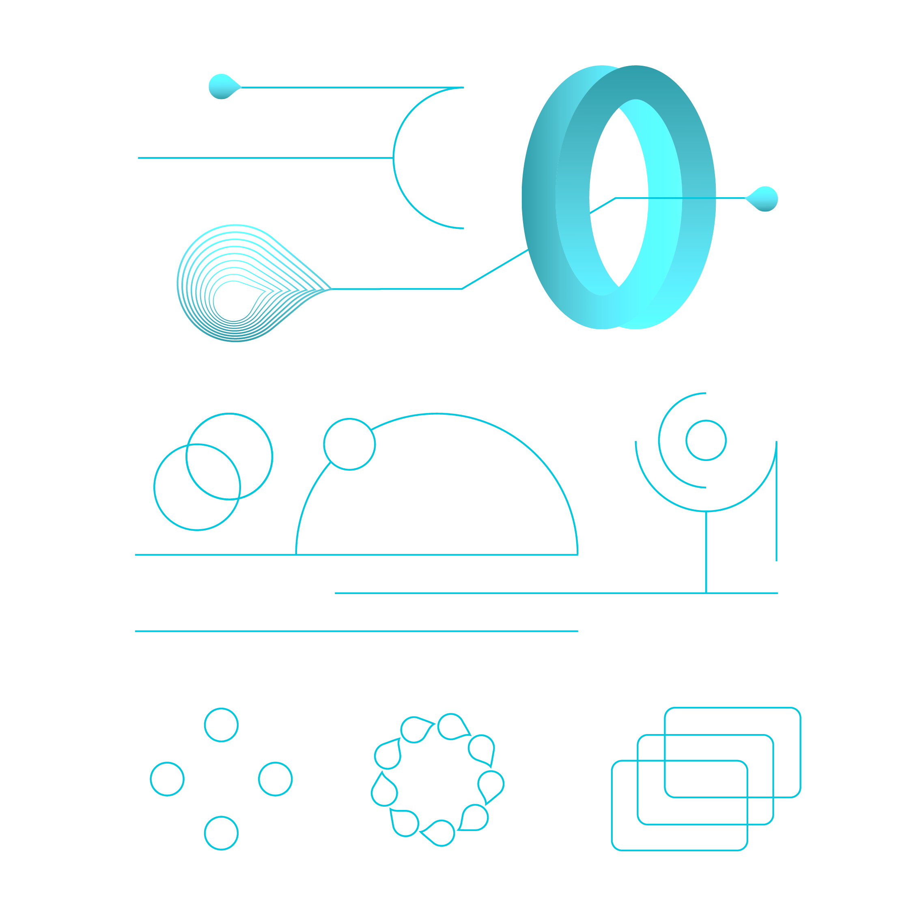

# What is Topos?

The first chapter of the Topos Developer Portal provides a high-level overview of Topos, the world's first zero-knowledge ecosystem. It introduces some central concepts, provides a number of illustrative use cases and ends with a walkthrough of a typical transaction flow.

<Banner>
  <BannerImage></BannerImage>
  <BannerContent>
    ## Start learning
    
    If you feel ready to dive right in, click below to begin your learning journey with Topos.

    <ButtonLink to={'/content/module-1/1-introduction.html'} label="Get started!" />

    Chapter 1 covers the following specific subjects:
  </BannerContent>
</Banner>

<Grid columns={2}>
  <GridItem>
    <Card title="1: Introduction" to={'/content/module-1/1-introduction.html'}>
      This unit provides a brief, accessible overview of the concepts behind Topos and outlines its advantages for developers of smart contracts and distributed applications.
    </Card>
  </GridItem>

  <GridItem>
    <Card title="2: Why Topos?" to={'/content/module-1/2-why-topos.html'}>
      This unit outlines in more detail how the ease of deployment, unbounded scalability, uniform security and provable computation of Topos makes it an ideal solution for interoperable blockchain applications.
    </Card>
  </GridItem>

  <GridItem>
    <Card title="3: Use cases" to={'/content/module-1/3-use-cases.html'}>
      This unit presents a quartet of use cases illustrating the strengths of Topos. They cover interoperable dApps, complex multi-chain operations, secure applications and customizable logic integration, providing both general overviews and specific examples.
    </Card>
  </GridItem>

  <GridItem>
    <Card title="4: The Topos protocol" to={'/content/module-1/4-protocol.html'}>
      This unit details the numerous elements which make up the Topos Protocol, including subnets, the Universal Certification Interface (UCI), sequencers, the Transmission Control Engine (TCE), the zero-knowledge Ethereum Virtual Machine (zkEVM), certificates, the ICE-FROST threshold signature scheme and Topos contracts.
    </Card>
  </GridItem>

  <GridItem>
    <Card title="5: Cross-chain and cross-subnet messages" to={'/content/module-1/5-cross-subnet.html'}>
      This unit explains the important distinction between cross-subnet messages, which are made possible in Topos, and cross-chain transactions, which feature in typical blockchain ecosystems. It examines common challenges of cross-chain transactions and illustrates the solution that Topos provides.
    </Card>
  </GridItem>

  <GridItem>
    <Card title="6: Cross-subnet messaging protocol" to={'/content/module-1/6-messaging-protocol.html'}>
      This unit provides a generalized description of the cross-subnet messaging flow.
    </Card>
  </GridItem>
</Grid>
