# ERC20 Messaging dApp

It is time to make your first steps with the Topos `Testnet` and get familiar with it. To do so, you will use a basic dApp provided by Topos: the **[Topos ERC20 Messaging dApp](https://dapp-frontend-erc20.testnet-1.topos.technology/)**. It is a sample application that allows you to experience Topos as a user. Later, you can find out more about the actions that are triggered and executed on the `Testnet` during your test.

## Visit the ERC20 Messaging dApp

<HighlightBox type="info" title="Note">

Please make sure you have installed [MetaMask](https://metamask.io/download/) before continuing.

</HighlightBox>

With MetaMask installed, you can navigate to [ERC20 Messaging](https://dapp-frontend-erc20.testnet-1.topos.technology/):

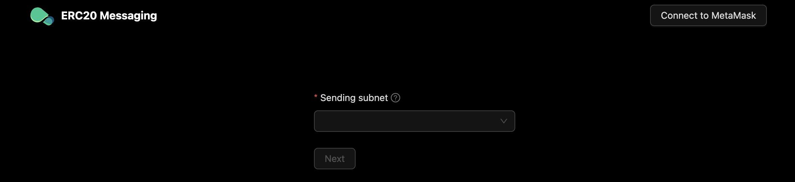 

You are now going to complete a cross-subnet, fungible token transfer from the Topos Subnet to the Incal subnet.

<Steps>
<StepItem>

First, you must connect MetaMask with the **ERC20 Messaging dApp**:

<ZoomImage small>
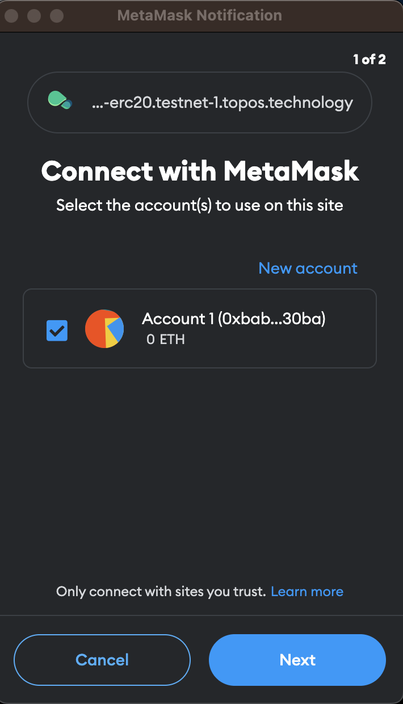 
</ZoomImage>

<ZoomImage small>
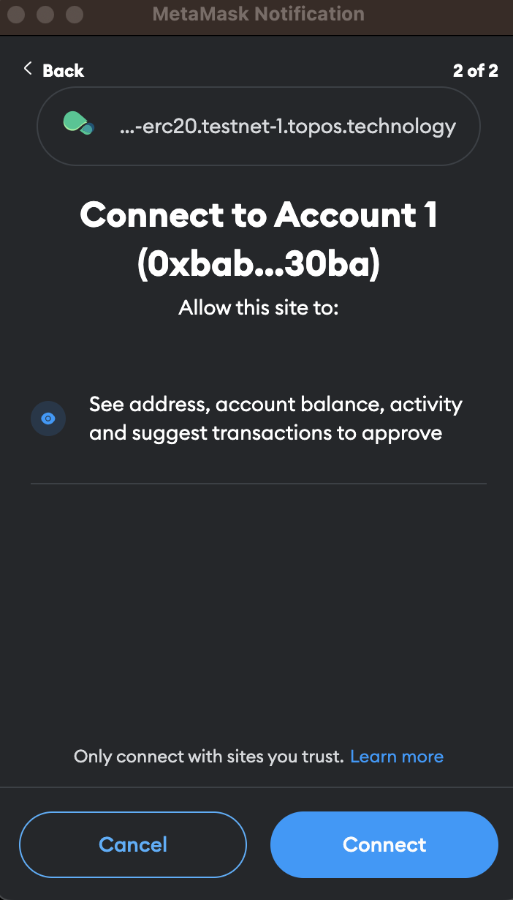
</ZoomImage>

The ERC20 Messaging dApp will display your address in the right top corner after the ERC20 dApp is connected to your wallet:

<ZoomImage small>
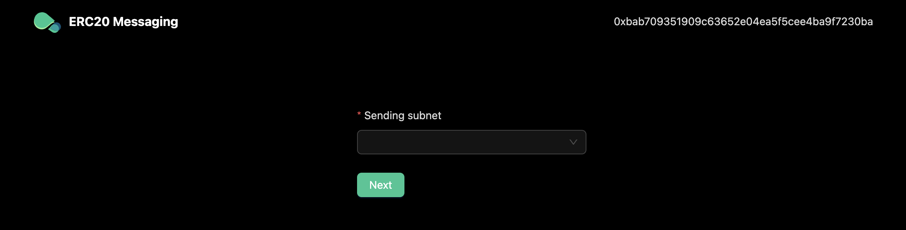
</ZoomImage>

Each time you pick up a sending subnet it will be automatically added to MetaMask, if it is the first time you attempt to do so.

Add Topos to your networks:

<ZoomImage small>
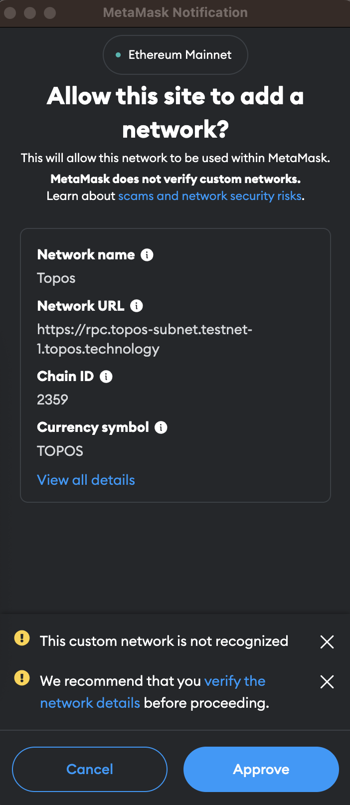
</ZoomImage>

Add Incal too:

<ZoomImage small>
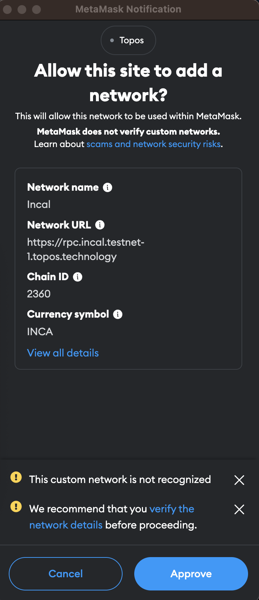
</ZoomImage>

If the network is already added to MetaMask, it will just ask for permission to switch the network if you pick up a subnet. For example, for Topos:

<ZoomImage small>
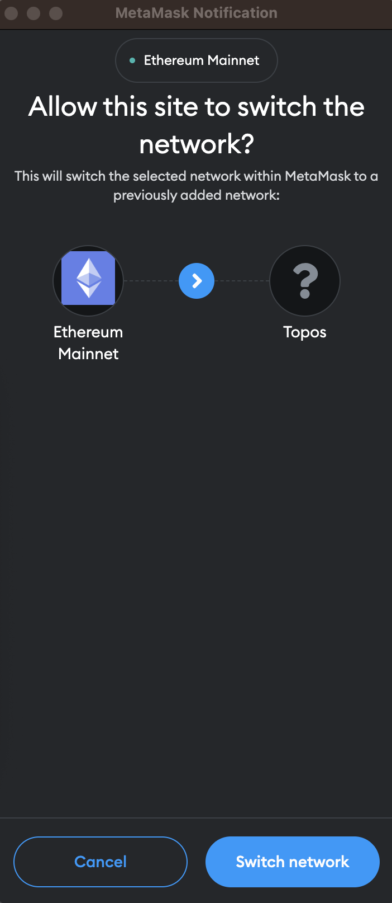
</ZoomImage>

Or for Incal:

<ZoomImage small>
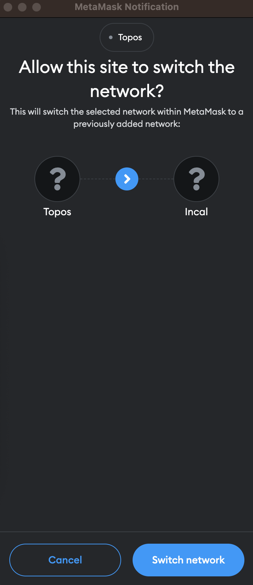
</ZoomImage>

</StepItem>
<StepItem>

In either case, select the **Incal subnet** in the dApp:

<ZoomImage small>
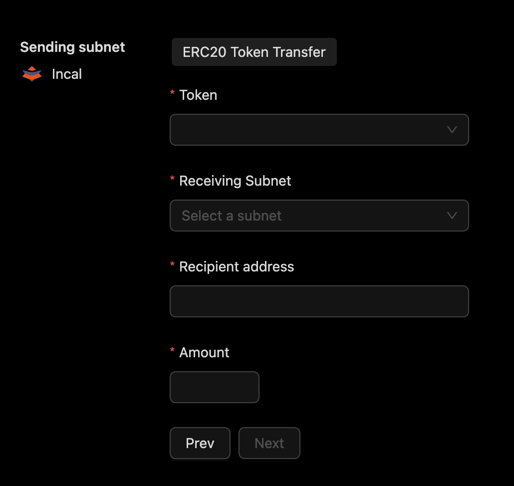
</ZoomImage>

</StepItem>
<StepItem>

Register a token, here named `testToken`:

<ZoomImage small>
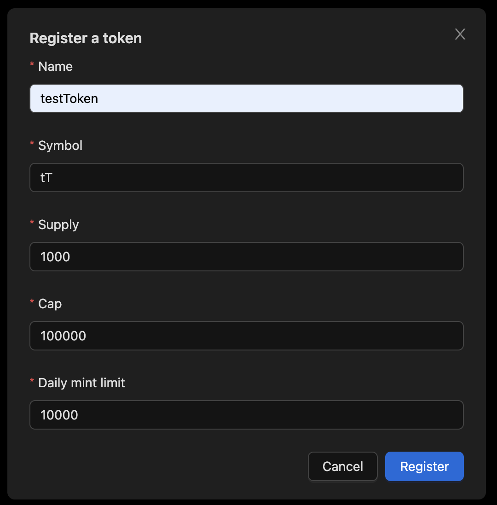
</ZoomImage>

<HighlightBox type="warning" title="Faucet">

In order to register tokens on the subnets, you will need to pay fees on both subnets. Use the [Topos Faucet](https://faucet.testnet-1.topos.technology):

<ZoomImage small>
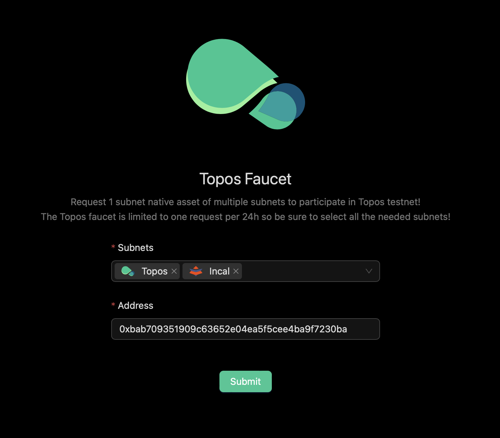
</ZoomImage>

Make sure that the tokens are sent:

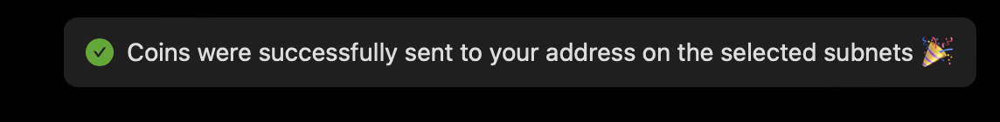

Now you can pay the necessary fee for a token registration (e.g., for the Incal subnet):

<ZoomImage small>
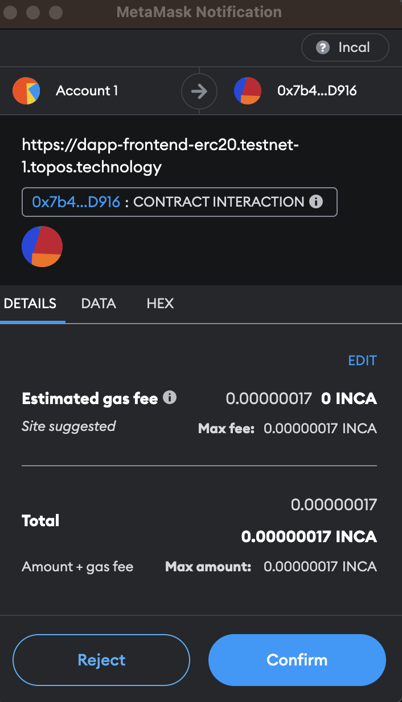
</ZoomImage>

</HighlightBox>

</StepItem>
<StepItem>

Repeat these steps for the **Topos Subnet**.

</StepItem>

<StepItem>

With both token setups done, you can try your first cross-subnet token transfer:

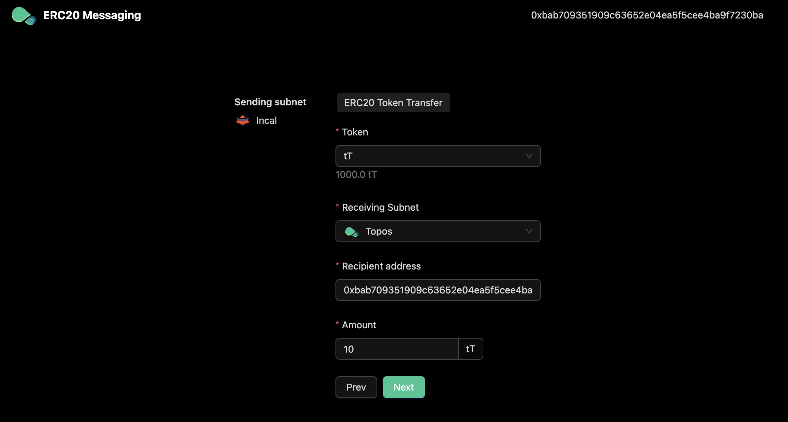

</StepItem>
<StepItem>

The ERC20 Messaging dApp will list the different steps involved in the cross-subnet transfer process:

<ZoomImage small>
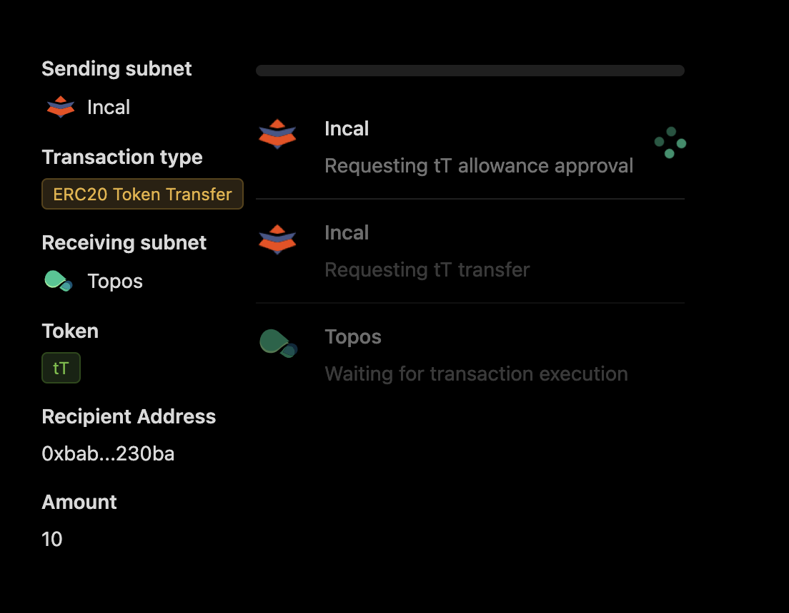
</ZoomImage>

First, approve the actions:

<ZoomImage small>
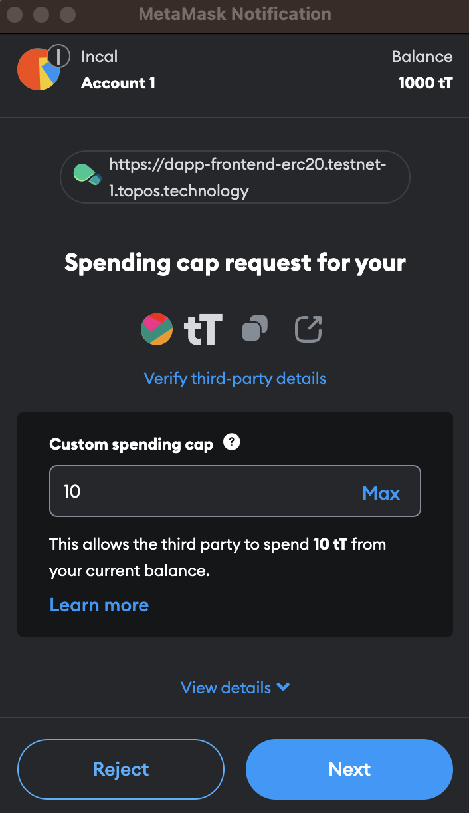
</ZoomImage>

<HighlightBox type="info" title="Note">

A cross-subnet ERC20 token transfer involves you approving several actions:
1. Make allowance for token burn by sending an **approve** transaction to [the token contract](https://github.com/topos-protocol/topos-smart-contracts/blob/main/contracts/topos-core/BurnableMintableCappedERC20.sol) you deployed during registration of a new token. This step is not always required (for example, if you did not hit the maximum you set in this step during the next step).
2. Burn tokens on the Incal subnet and emit an event by sending a **sendToken** transaction to **ERC20Messaging** contract.

</HighlightBox>

The ERC20 Messaging dApp will wait for the transaction to be executed:

<ZoomImage small>
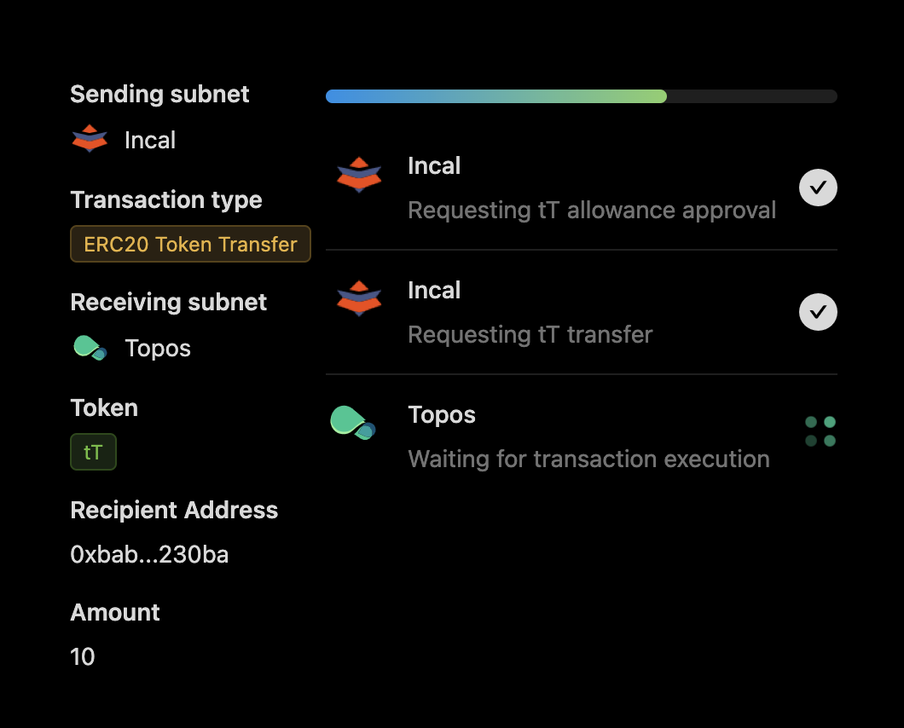
</ZoomImage>

It should give you a success message, like the following:

<ZoomImage small>
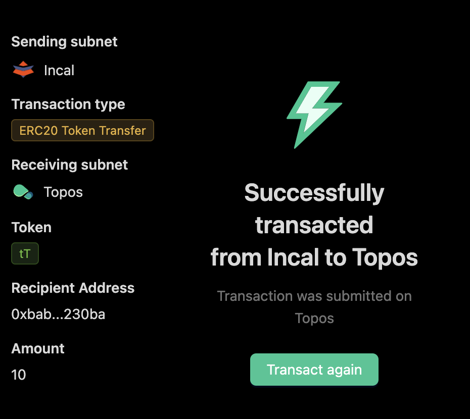
</ZoomImage>

</StepItem>
</Steps>

**Congratulations! You have completed your first cross-subnet token transfer.**

<HighlightBox type="alert" title="Troubleshooting">

<Accordion title="Troubleshooting">
<AccordionItem title="Clear MetaMask's activity data">

MetaMask remembers the [nonce](https://ethereum.org/en/developers/docs/transactions/) it used for your last transaction. This is an issue if you `clean` and re-`start` your playground, as transaction nonces have to start from `0` on a new network. Follow [this guideline](https://support.metamask.io/hc/en-us/articles/360015488891-How-to-clear-your-account-activity-reset-account).

</AccordionItem>
<AccordionItem title="Disconnect your MetaMask account">

You can never be too sure that you cleaned your setup enough, so if in doubt you can disconnect your MetaMask account from the frontend. For information on this, follow [this guideline](https://support.metamask.io/hc/en-us/articles/360059535551-Disconnect-wallet-from-a-dapp).

</AccordionItem>
<AccordionItem title="Delete the networks from MetaMask">

Networks may change between Playground versions, while MetaMask may believe that it has the correct information based solely on an ID. To remove the Topos and Incal networks from MetaMask, follow [this guideline](https://support.metamask.io/hc/en-us/articles/4502810252059-How-to-remove-networks).

</AccordionItem>
</Accordion>

</HighlightBox>

## Under the hood

The following steps describe what actually happened:

1. The ERC20 Messaging frontend deployed a token contract on each subnet for the token you registered on it.
2. It submitted a transaction to the Incal subnet in order to burn the transferred tokens on the Incal subnet.
3. It made a request on the [executor service](https://github.com/topos-protocol/executor-service). It submitted the Merkle proof of the transaction (proof of inclusion of its receipt in the receipt trie of the certified state transition) and the root of the transaction trie to the executor service, which is used by the **ERC20Messaging** contract to retrieve the certificate from the **ToposCore** contract.
4. This certificate was emitted and then stored on-chain by the Topos Subnet.
5. The Topos Subnet minted your transferred tokens.

# Up next

You have invoked your first cross-subnet token transfer with Topos. In the next section, you will use Topos Explorer to see the certificates that were created.
