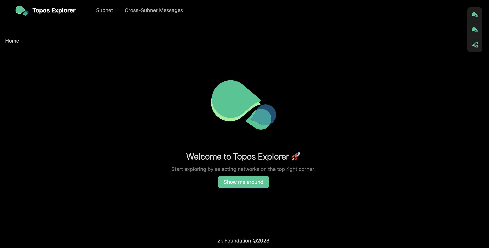
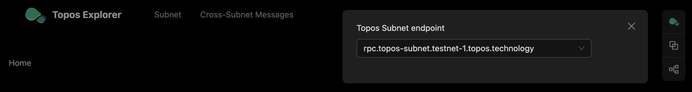
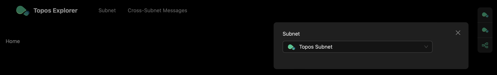
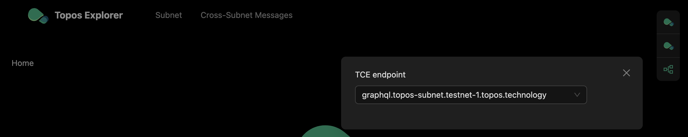
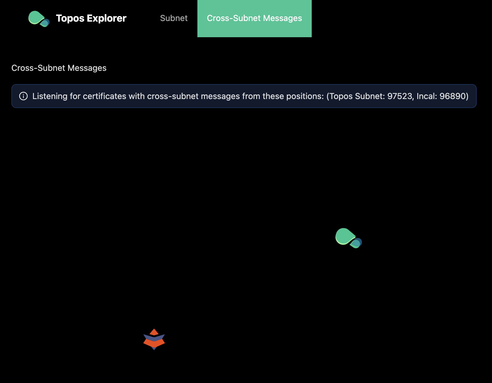
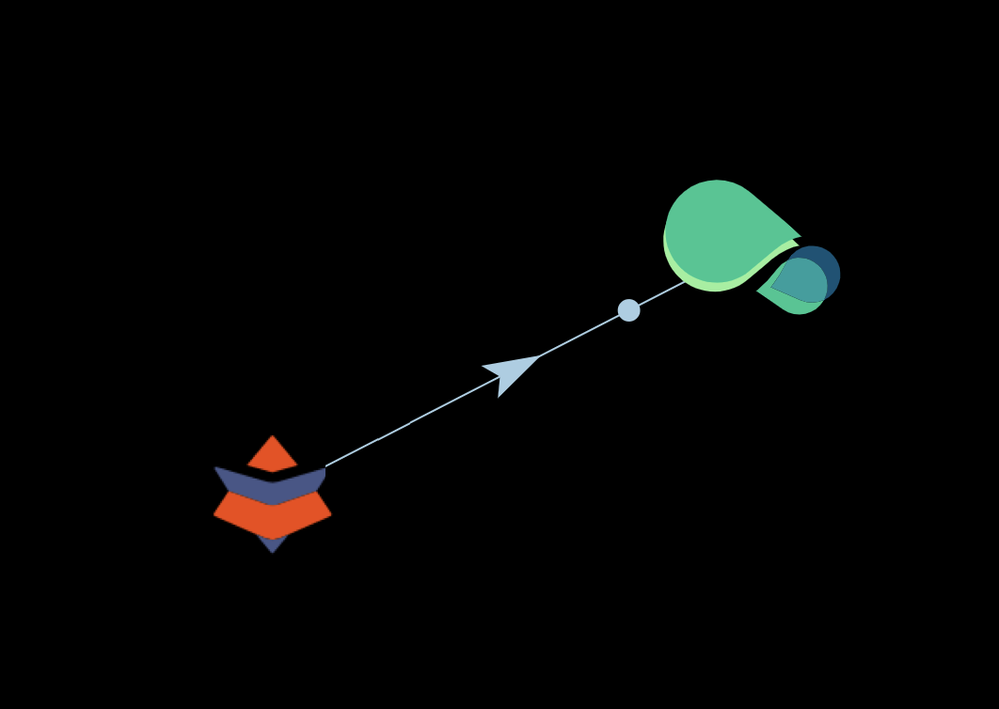
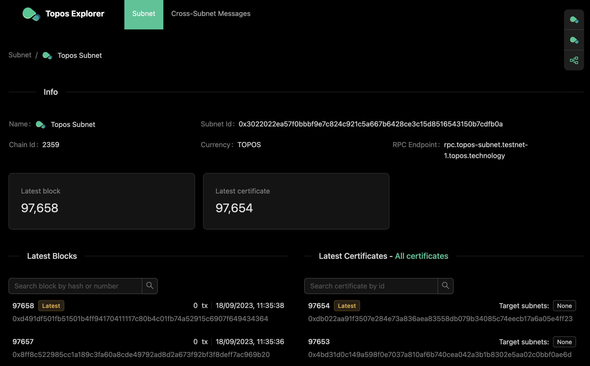
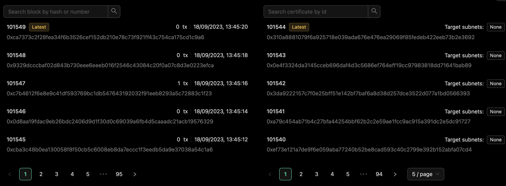
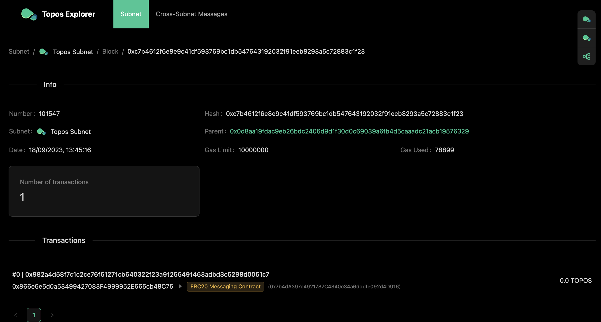

# Topos Explorer

You have tried the **ERC20 Messaging dApp** to see Topos in action and have executed a cross-subnet token transfer. You were presented with a very high-level view of what happened, just like what a user would see.

You can now use the **[Topos Explorer](https://explorer.testnet-1.topos.technology)** to see more details. Because Topos subnets are EVM-based, an explorer for Topos can use the standard Ethereum [JSON-RPC API](https://ethereum.org/en/developers/docs/apis/json-rpc/). In addition, the Transmission Control Engine (TCE) will expose a [GraphQL](https://en.wikipedia.org/wiki/GraphQL) endpoint.

{/* include more information about the TCE API if available */}

<Steps>
<StepItem>

Navigate to the [Topos Explorer](https://explorer.testnet-1.topos.technology):

</StepItem>

<StepItem>

Select the correct RPC endpoint to reach the Topos Subnet running in `Testnet`:

</StepItem>

<StepItem>

Select the subnet you want to explore:

</StepItem>

<StepItem>

Then select the correct TCE endpoint:

This should connect the Explorer to `Testnet`. In the *Cross-Subnet Messages* tab, you should see the Topos Subnet and the Incal subnet:

If you or someone else invokes a cross-subnet transaction, you will observe its related certificate in the graph visualization:

<ZoomImage small>

</ZoomImage>

</StepItem>

<StepItem>

If you look at the **Topos Subnet** by clicking on the *Subnet* tab, you will observe multiple pieces of information about the subnet:
- Subnet name
- Subnet ID
- Subnet currency
- Subnet RPC endpoint
- Latest blocks being created
- Latest certificates being created

The Explorer displays live data without an indexer running in the background, meaning that in its current state you do not have access to historical blocks. Nevertheless you can find a link to [all certificates](https://explorer.testnet-1.topos.technology/subnet/certificates) above the latest certificates or search old blocks and certificates.

During your tests with the Playground, you created some transactions. Look for the blocks including these transactions:

You can see further details by clicking on a block:

Here you can see that the cross-subnet token transfer you invoked triggered a call on the **ERC20 Messaging Contract**.

</StepItem>
</Steps>

<HighlightBox type="info" title="Remember">

You learned about the **ERC20Messaging** contract in the [first chapter](../module-1/4-protocol.html#messaging-protocol-smart-contracts). This optional contract is used in the context of the **ERC20 Messaging dApp** for cross-subnet token transfers.

Topos guarantees that certificates are delivered with certain conditions fulfilled, like causal ordering. The execution logic of the transactions included in those certificates is not part of the core protocol. The [Topos executor service](https://github.com/topos-protocol/executor-service) on the other hand is an example implementation for such a logic. You can call the [executor service API endpoint](https://executor-service.testnet-1.topos.technology/api/v1) in your browser to explore what's on offer. Note that you will need to [authenticate your request](https://github.com/topos-protocol/executor-service#authentication-auth0).

</HighlightBox>

# Up next

It is nice to have these kinds of tools to get started with a new protocol. Of course, we have glossed over a lot of details. The next section will explain how to run a local network and examine the actions performed during your test.
