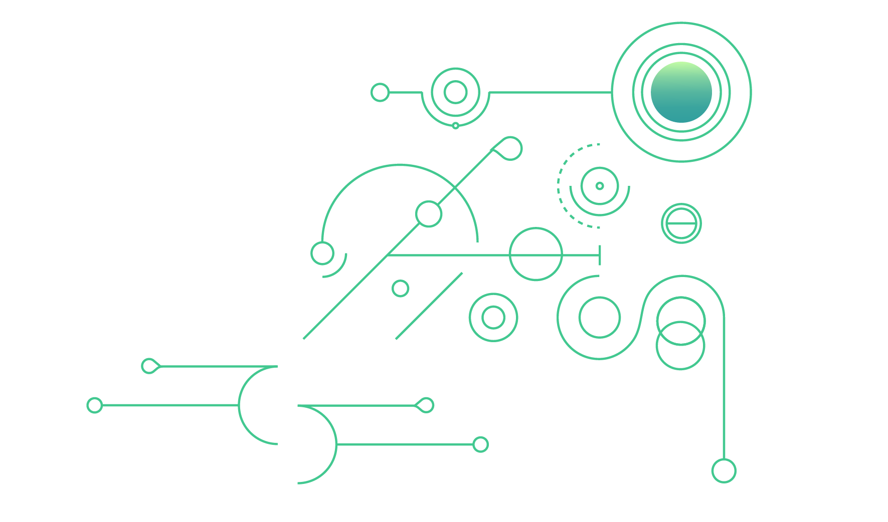

# Next steps

The third chapter of the Topos Developer Portal introduces you to more advanced topics, notably the development of custom messaging protocols, a key feature of Topos that allows you to fully embrace its cross-subnet messaging capabilities.

<Banner>
  <BannerImage></BannerImage>
  <BannerContent>
    ## Start developing

    If you're ready to go, click below to begin developing your own messaging protocol.

    <ButtonLink to={'/content/module-3/1-create-your-messaging-protocol.html'} label="Time to code!" />

    Chapter 3 covers the following specific subjects:
  </BannerContent>
</Banner>

<Grid columns={2}>
  <GridItem>
      <Card title="1: Create Your Messaging Protocol" to={'/content/module-3/1-create-your-messaging-protocol.html'}>
      This unit goes over concepts tied to messaging protocols that were already introduced before, but this time we're going to make a hands-on exploration of how to develop a custom messaging protocol in the fashion of ERC20Messaging.
    </Card>
  </GridItem>
</Grid>
