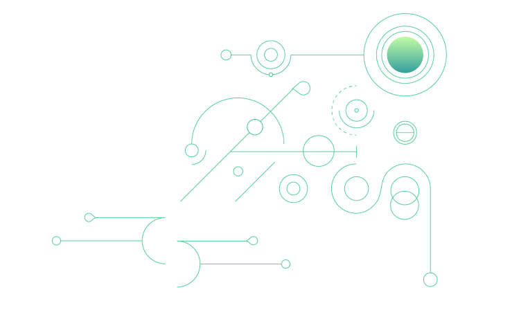

# Features overview

This file demonstrates the usage of various components within the Platform.
All the components can include any markdown and be nested with each others.

# Basic Markdown

## Lists

**Simple unordered list:**

* Item 1
* Item 2
* Item 3

**Simple ordered list:**

1. Item 1
2. Item 2
3. Item 3

**List with sub-items:**

* Item 1
  * Sub-item 1
  * Sub-item 2
* Item 2
  * Sub-item 2-1
  * Sub-item 2-2
* Item 3

## Images

### Regular image

Opens in a new tab



### Zoom image
<ZoomImage>
  
</ZoomImage>

With `small` prop:

<ZoomImage small>
  
</ZoomImage>


# Extended components

## HighlightBox

<HighlightBox type="tip" title="Tip">
Dorothy followed her through many of the beautiful rooms in her castle.

Dorothy followed her through many of the beautiful rooms in her castle.
</HighlightBox>

<HighlightBox type="alert" tile="Alert">
Dorothy followed her through many of the beautiful rooms in her castle.
</HighlightBox>

 <HighlightBox type="info" title="Info">
Dorothy followed her through many of the beautiful rooms in her castle.
</HighlightBox>

## Youtube Video

<YoutubePlayer videoId="FP7KI3Ol1Sw" />

## Toggle Section

<Accordion>
<AccordionItem title="Title test 1">
Lorem ipsum dolor sit amet, consectetur adipiscing elit. Nunc aliquet ligula sed dolor   tincidunt, vel pulvinar risus faucibus. Donec in sodales turpis, faucibus aliquet quam. Sed faucibus ac arcu et sollicitudin. Nam mauris nisl, pulvinar at tempus vel, molestie quis est. Maecenas efficitur, neque sed varius cursus, magna ligula facilisis ex, non gravida eros lacus sed odio.
</AccordionItem>
</Accordion>

## Accordion

<Accordion>
<AccordionItem title="Title test 1">
Lorem ipsum dolor sit amet, consectetur adipiscing elit. Nunc aliquet ligula sed dolor   tincidunt, vel pulvinar risus faucibus. Donec in sodales turpis, faucibus aliquet quam. Sed faucibus ac arcu et sollicitudin. Nam mauris nisl, pulvinar at tempus vel, molestie quis est. Maecenas efficitur, neque sed varius cursus, magna ligula facilisis ex, non gravida eros lacus sed odio.
</AccordionItem>
<AccordionItem title="Title test 2">
Lorem ipsum dolor sit amet, consectetur adipiscing elit. Nunc aliquet ligula sed dolor   tincidunt, vel pulvinar risus faucibus. Donec in sodales turpis, faucibus aliquet quam. Sed faucibus ac arcu et sollicitudin. Nam mauris nisl, pulvinar at tempus vel, molestie quis est. Maecenas efficitur, neque sed varius cursus, magna ligula facilisis ex, non gravida eros lacus sed odio.
</AccordionItem>
<AccordionItem title="Title test 3">
Lorem ipsum dolor sit amet, consectetur adipiscing elit. Nunc aliquet ligula sed dolor   tincidunt, vel pulvinar risus faucibus. Donec in sodales turpis, faucibus aliquet quam. Sed faucibus ac arcu et sollicitudin. Nam mauris nisl, pulvinar at tempus vel, molestie quis est. Maecenas efficitur, neque sed varius cursus, magna ligula facilisis ex, non gravida eros lacus sed odio.
</AccordionItem>
</Accordion>

## Tabs 

<TabGroup>
<TabGroupItem title="Tab 1" active>
#### Tab 1 content

Lorem ipsum dolor sit amet, consectetur adipiscing elit. Nunc aliquet ligula sed dolor   tincidunt, vel pulvinar risus faucibus. Donec in sodales turpis, faucibus aliquet quam. Sed faucibus ac arcu et sollicitudin. Nam mauris nisl, pulvinar at tempus vel, molestie quis est. Maecenas efficitur, neque sed varius cursus, magna ligula facilisis ex, non gravida eros lacus sed odio.

Lorem ipsum dolor sit amet, consectetur adipiscing elit. Nunc aliquet ligula sed dolor   tincidunt, vel pulvinar risus faucibus. Donec in sodales turpis, faucibus aliquet quam. Sed faucibus ac arcu et sollicitudin. Nam mauris nisl, pulvinar at tempus vel, molestie quis est. Maecenas efficitur, neque sed varius cursus, magna ligula facilisis ex, non gravida eros lacus sed odio.
</TabGroupItem>

<TabGroupItem title="Tab 2">
#### Tab 2 content

Lorem ipsum dolor sit amet, consectetur adipiscing elit. Nunc aliquet ligula sed dolor   tincidunt, vel pulvinar risus faucibus. Donec in sodales turpis, faucibus aliquet quam. Sed faucibus ac arcu et sollicitudin. Nam mauris nisl, pulvinar at tempus vel, molestie quis est. Maecenas efficitur, neque sed varius cursus, magna ligula facilisis ex, non gravida eros lacus sed odio.

Lorem ipsum dolor sit amet, consectetur adipiscing elit. Nunc aliquet ligula sed dolor   tincidunt, vel pulvinar risus faucibus. Donec in sodales turpis, faucibus aliquet quam. Sed faucibus ac arcu et sollicitudin. Nam mauris nisl, pulvinar at tempus vel, molestie quis est. Maecenas efficitur, neque sed varius cursus, magna ligula facilisis ex, non gravida eros lacus sed odio.
</TabGroupItem>

<TabGroupItem title="Tab 3">
#### Tab 3 content

Lorem ipsum dolor sit amet, consectetur adipiscing elit. Nunc aliquet ligula sed dolor   tincidunt, vel pulvinar risus faucibus. Donec in sodales turpis, faucibus aliquet quam. Sed faucibus ac arcu et sollicitudin. Nam mauris nisl, pulvinar at tempus vel, molestie quis est. Maecenas efficitur, neque sed varius cursus, magna ligula facilisis ex, non gravida eros lacus sed odio.

Lorem ipsum dolor sit amet, consectetur adipiscing elit. Nunc aliquet ligula sed dolor   tincidunt, vel pulvinar risus faucibus. Donec in sodales turpis, faucibus aliquet quam. Sed faucibus ac arcu et sollicitudin. Nam mauris nisl, pulvinar at tempus vel, molestie quis est. Maecenas efficitur, neque sed varius cursus, magna ligula facilisis ex, non gravida eros lacus sed odio.
</TabGroupItem>
<TabGroupItem title="Tab 4">
#### Tab 4 content

Lorem ipsum dolor sit amet, consectetur adipiscing elit. Nunc aliquet ligula sed dolor   tincidunt, vel pulvinar risus faucibus. Donec in sodales turpis, faucibus aliquet quam. Sed faucibus ac arcu et sollicitudin. Nam mauris nisl, pulvinar at tempus vel, molestie quis est. Maecenas efficitur, neque sed varius cursus, magna ligula facilisis ex, non gravida eros lacus sed odio.

Lorem ipsum dolor sit amet, consectetur adipiscing elit. Nunc aliquet ligula sed dolor   tincidunt, vel pulvinar risus faucibus. Donec in sodales turpis, faucibus aliquet quam. Sed faucibus ac arcu et sollicitudin. Nam mauris nisl, pulvinar at tempus vel, molestie quis est. Maecenas efficitur, neque sed varius cursus, magna ligula facilisis ex, non gravida eros lacus sed odio.
</TabGroupItem>
</TabGroup>

## Code


```
import * as CSS from 'csstype';

const style: CSS.Properties = {
  colour: 'black', // Type error on property
  textAlign: 'grey', // Type error on value
};
-    return {
-      placeholderText: "Drag and drop a file here",
-      hashed: "",
-      flight: false,
-    };
+    return {};
```

```diff-ts
import * as CSS from 'csstype';

const style: CSS.Properties = {
  colour: 'white', // Type error on property
  textAlign: 'middle', // Type error on value
};
-    return {
-      placeholderText: "Drag and drop a file here",
-      hashed: "",
-      flight: false,
-    };
+    return {};
```

```diff
import * as CSS from 'csstype';

const style: CSS.Properties = {
  colour: 'white', // Type error on property
  textAlign: 'middle', // Type error on value
};
-    return {
-      placeholderText: "Drag and drop a file here",
-      hashed: "",
-      flight: false,
-    };
+    return {};
```

<CodeBlock url="https://github.com/topos-protocol/dev-portal" title="src/test.py">
```py
for line in fileinput.input(inplace=1):
    line = re.sub(r"\s\\#([0-9]+)", r" [\\#\1](https://github.com/topos-protocol/dev-portal/\1)", line.rstrip())
    print(line)
```
</CodeBlock>

<GitHubBlock org="topos-protocol" repo="topos-playground" path="/src/main.ts" lines="2..13" highlights="7" language="typescript" />

<TabGroup>
<TabGroupItem title="Javascript" active>

```js
import { SpH3, SpButton } from "@tendermint/vue";

export default {
  components: {
    SpH3,
    SpButton,
  },
  data() {
    return {
      placeholderText: "Drag and drop a file here",
      hashed: "",
      flight: false,
    };
  },
  methods: {
    hash(e) {},
    async submit() {},
  }
}
export default {
  components: {
    SpH3,
    SpButton,
  },
  data() {
    return {
      placeholderText: "Drag and drop a file here",
      hashed: "",
      flight: false,
    };
  },
  methods: {
    hash(e) {},
    async submit() {},
  }
}
export default {
  components: {
    SpH3,
    SpButton,
  },
  data() {
    return {
      placeholderText: "Drag and drop a file here",
      hashed: "",
      flight: false,
    };
  },
  methods: {
    hash(e) {},
    async submit() {},
  }
}
export default {
  components: {
    SpH3,
    SpButton,
  },
  data() {
    return {
      placeholderText: "Drag and drop a file here",
      hashed: "",
      flight: false,
    };
  },
  methods: {
    hash(e) {},
    async submit() {},
  }
}
export default {
  components: {
    SpH3,
    SpButton,
  },
  data() {
    return {
      placeholderText: "Drag and drop a file here",
      hashed: "",
      flight: false,
    };
  },
  methods: {
    hash(e) {},
    async submit() {},
  }
}
```

</TabGroupItem>
<TabGroupItem title="Typescript">

```ts
import * as CSS from 'csstype';

const style: CSS.Properties = {
  colour: 'white', // Type error on property
  textAlign: 'middle', // Type error on value
};
```

</TabGroupItem>

<TabGroupItem title="Go">

```go
// OnTimeoutIbcPostPacket responds to the case where a packet has not been transmitted because of a timeout
func (k Keeper) OnTimeoutIbcPostPacket(ctx sdk.Context, packet channeltypes.Packet, data types.IbcPostPacketData) error {
    k.AppendTimedoutPost(
        ctx,
        types.TimedoutPost{
            Creator: data.Creator,
            Title: data.Title,
            Chain: packet.DestinationPort+"-"+packet.DestinationChannel,
        },
    )

    return nil
}
```

</TabGroupItem>
</TabGroup>

## Steps

<Steps>
<StepItem>

First step

```shell
npm i
```

</StepItem>

<StepItem>
Second step

```shell
npm run dev
```

</StepItem>

<StepItem>
## Title markdown
Lorem ipsum dolor sit amet
</StepItem>
</Steps>

## Quiz

<Questionnaire source="quiz-1" />

## Image Carousel

<ImageCarousel>


</ImageCarousel>


## Button Link

<ButtonLink to={'/content/module-1/introduction.html'} label="Button label" />

## Card

<Card title="Title" to={'/content/module-1/introduction.html'}>
  Lorem ipsum dolor sit amet, consectetur adipiscing elit. Nulla venenatis dui eu massa semper, sit amet venenatis sapien placerat.
</Card>

## Banner

<Banner>
  <BannerImage></BannerImage>
  <BannerContent>
    ## A markdown title
    
    Lorem ipsum dolor sit amet, consectetur adipiscing elit. Nulla venenatis dui eu massa semper, sit amet venenatis sapien placerat. Mauris tincidunt tortor eget libero laoreet consectetur.

    <ButtonLink to={'/content/module-1/introduction.html'} label="Button label" />

    <HighlightBox type="info" noIcon>
      Lorem ipsum dolor sit amet, consectetur adipiscing elit. Nulla venenatis dui eu massa semper, sit amet venenatis sapien placerat. Mauris tincidunt tortor eget libero laoreet consectetur.
    </HighlightBox>
  </BannerContent>
</Banner>

## Grid

Can be of 2 or 3 columns on desktop view
Will fill the grid if the count is not divisible by the columns set as props.

### 2 columns

<Grid columns={2}>
  <GridItem>
    <Card title="Title" to={'/content/module-1/introduction.html'}>
      Lorem ipsum dolor sit amet, consectetur adipiscing elit. Nulla venenatis dui eu massa semper, sit amet venenatis sapien placerat.
      Lorem ipsum dolor sit amet, consectetur adipiscing elit. Nulla venenatis dui eu massa semper, sit amet venenatis sapien placerat.
    </Card>
  </GridItem>

  <GridItem>
    <Card title="Title" to={'/content/module-1/introduction.html'}>
      Lorem ipsum dolor sit amet, consectetur adipiscing elit. Nulla venenatis dui eu massa semper, sit amet venenatis sapien placerat.
    </Card>
  </GridItem>
</Grid>

### 3 Columns

<Grid columns={3}>
  <GridItem>
    <Card title="Title" to={'/content/module-1/introduction.html'}>
      Lorem ipsum dolor sit amet, consectetur adipiscing elit. Nulla venenatis dui eu massa semper, sit amet venenatis sapien placerat.
    </Card>
  </GridItem>

  <GridItem>
    <Card title="Title" to={'/content/module-1/introduction.html'}>
      Lorem ipsum dolor sit amet, consectetur adipiscing elit. Nulla venenatis dui eu massa semper, sit amet venenatis sapien placerat.
    </Card>
  </GridItem>

  <GridItem>
    <Card title="Title" to={'/content/module-1/introduction.html'}>
      Lorem ipsum dolor sit amet, consectetur adipiscing elit. Nulla venenatis dui eu massa semper, sit amet venenatis sapien placerat.
    </Card>
  </GridItem>

  <GridItem>
    <Card title="Title" to={'/content/module-1/introduction.html'}>
      Lorem ipsum dolor sit amet, consectetur adipiscing elit. Nulla venenatis dui eu massa semper, sit amet venenatis sapien placerat.
    </Card>
  </GridItem>

  <GridItem>
    <HighlightBox title="Info" type="alert">
      Lorem ipsum dolor sit amet, consectetur adipiscing elit. Nulla venenatis dui eu massa semper, sit amet venenatis sapien placerat.
    </HighlightBox>
  </GridItem>
</Grid>

## Graphs, Flow charts

You can define some graph in the markdown, using the syntax from [mermaidjs](https://mermaid.js.org/)

### Graph


## LateX (KateX)

### Inline
This is an inline $a^2 + b^2 = c^2$ (equation)

### Display mode
$$
a^2 + b^2 = c^2
$$

